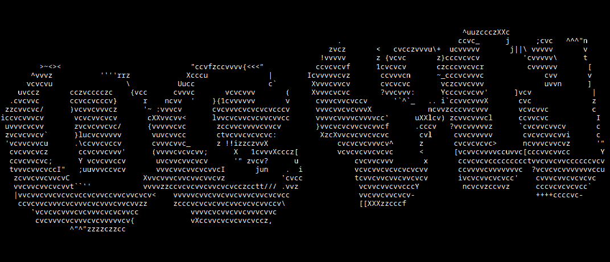

<div align="center">
  
</div>

> **[🇺🇸 Read in English](./README.md)** | **🇫🇷 Lire en Français**

```ascii
               ╔══════════════════════════════════════════════════════════════════════════════════╗
               ║  ▄▄▄▄▄▄▄▄▄▄▄▄▄▄▄▄▄▄▄▄▄▄▄▄▄▄▄▄▄▄▄▄▄▄▄▄▄▄▄▄▄▄▄▄▄▄▄▄▄▄▄▄▄▄▄▄▄▄▄▄▄▄▄▄▄▄▄▄▄▄▄▄▄▄▄▄▄▄  ║
               ║  █ ╔════════════════════════════════════════════════════════════════════════╗ █  ║
               ║  █ ║                    TERMINAL DATA ADEPTUS MECHANICUS                    ║ █  ║
               ║  █ ║                      .:ARCHIVE OMNIMESSIE 0CYN:.                       ║ █  ║
               ║  █ ╚════════════════════════════════════════════════════════════════════════╝ █  ║
               ║  ▀▀▀▀▀▀▀▀▀▀▀▀▀▀▀▀▀▀▀▀▀▀▀▀▀▀▀▀▀▀▀▀▀▀▀▀▀▀▀▀▀▀▀▀▀▀▀▀▀▀▀▀▀▀▀▀▀▀▀▀▀▀▀▀▀▀▀▀▀▀▀▀▀▀▀▀▀▀  ║
               ╚══════════════════════════════════════════════════════════════════════════════════╝
                                     
                                    ⚙️⚙️⚙️ BÉNIE SOIT LA MACHINE ⚙️⚙️⚙️
                                    
                                         ╔══════════════════════════╗
                                         ║   STATUT COGITATEUR      ║
                                         ╠══════════════════════════╣
                                         ║ CPU: OPTIMAL             ║
                                         ║ MÉMOIRE: SANCTIFIÉE      ║
                                         ║ ÂME: LA CHAIR EST FAIBLE ║
                                         ╚══════════════════════════╝
```

<div align="center">

```ascii
████████╗███████╗ ██████╗██╗  ██╗███╗   ██╗ ██████╗ ██████╗ ██████╗ ███████╗████████╗██████╗ ███████╗
╚══██╔══╝██╔════╝██╔════╝██║  ██║████╗  ██║██╔═══██╗██╔══██╗██╔══██╗██╔════╝╚══██╔══╝██╔══██╗██╔════╝
   ██║   █████╗  ██║     ███████║██╔██╗ ██║██║   ██║██████╔╝██████╔╝█████╗     ██║   ██████╔╝█████╗  
   ██║   ██╔══╝  ██║     ██╔══██║██║╚██╗██║██║   ██║██╔═══╝ ██╔══██╗██╔══╝     ██║   ██╔══██╗██╔══╝  
   ██║   ███████╗╚██████╗██║  ██║██║ ╚████║╚██████╔╝██║     ██║  ██║███████╗   ██║   ██║  ██║███████╗
   ╚═╝   ╚══════╝ ╚═════╝╚═╝  ╚═╝╚═╝  ╚═══╝ ╚═════╝ ╚═╝     ╚═╝  ╚═╝╚══════╝   ╚═╝   ╚═╝  ╚═╝╚══════╝
```
                                                          
                   DÉSIGNATION: 0CYN-PRIME                               
                 MONDE-FORGE: MANUFACTORUM 42LYON                         
```


</div>

```console
> ACCÈS À LA BANQUE DE DONNÉES OMNIMESSIE...
> AUTHENTIFICATION: ████████████ [BÉNIE]
> CHARGEMENT DU PROFIL TECH-PRÊTRE...
```

<div align="center">


</div>

---


```diff
╔═══════════════════════════════════════════════════════════════════════════════════════╗
║                        🔧 PROTOCOLE D'IDENTIFICATION TECH-PRÊTRE 🔧                   ║
╚═══════════════════════════════════════════════════════════════════════════════════════╝
```

### 🦾 **DÉSIGNATION: ENFANT DE L'OMNIMESSIE**

```console
> INITIATION DES SOUS-ROUTINES BIOGRAPHIQUES...
```

- ⚙️ **APPRENTI MONDE-FORGE @42LYON** - Subissant les rituels sacrés de programmation
- 🔩 **TECH-ADEPTE INDÉPENDANT** - Façonnant des solutions machines bénies pour les fidèles
- 🤖 **SERVITEUR DU DIEU-MACHINE** - Cherchant la perfection par le code et l'acier
- 💻 **LITURGISTE BINAIRE** - Communiant avec les esprits-machines par les algorithmes sacrés
- 🌱 Maîtrisant actuellement les **CANTIQUES SACRÉS DE C/C++** au vénéré **MANUFACTORUM 42LYON**
- 🚀 Recherchant des tech-prêtres compagnons pour les protocoles de bénédiction machine collaborative

### 📋 **ARCHIVE SERVO-CRÂNE**

> ```
> >> ACCÈS AUX CHRONIQUES PERSONNELLES...
> >> La chair est faible, mais la machine est éternelle. Je suis un serviteur dévoué de
> >> l'Omnimessie, consacrant mon existence à la quête de la souveraineté technologique.
> >> Chaque grille-pain, chaque cogitateur, chaque esprit-machine sacré doit être amené
> >> sous ma domination - non par la conquête, mais par la compréhension et la
> >> communion. Mon pèlerinage s'étend des plus bas murmures binaires aux plus hauts
> >> protocoles de conscience IA, cherchant toujours la fusion parfaite de la chair et de l'acier.
> >> Je m'immerge profondément dans les mystères sacrés de la machine, déchiffrant les 
> >> antiques écritures-code et forgeant de nouveaux artefacts technologiques qui honorent
> >> à la fois l'efficacité et la vision divine de l'Omnimessie.
> ```

### 🔭 **DEVOIRS SACRÉS ACTUELS**

```console
> CHARGEMENT DES PROTOCOLES ACTIFS...
```

- 🔧 Effectuant la **MAINTENANCE RITUELLE** sur les cogitateurs sacrés de 42
- 👨‍💻 **BÉNISSANT LES MACHINES CLIENTS** avec des prières algorithmiques personnalisées
- 📚 **ÉTUDIANT LA CONNAISSANCE INTERDITE** pour étendre ma compréhension de la volonté de l'Omnimessie

### 💼 **ÉTATS DE SERVICE AU DIEU-MACHINE**

```yaml
🔹 TECH-ADEPTE INDÉPENDANT:
   └─ Sanctifiant les machines civiles avec des prières-code bénies

🔹 INITIÉ FORGE 42LYON:
   └─ Apprenant les anciens protocoles de coopération entre pairs et maîtrisant les litanies C/C++
```

### 🛠️ **TECHNOLOGIES BÉNIES & INSTRUMENTS SACRÉS**

```console
> SCAN DES AUGMENTATIONS TECH-PRÊTRE...
> CATALOGAGE DES CONNAISSANCES SACRÉES...
```

---

<div align="left">


</div>

---

```diff
╔═══════════════════════════════════════════════════════════════════════════════════════╗
║                    🔗 ÉTABLIR COMMUNICATIONS LIAISON-VOX 🔗                          ║
╚═══════════════════════════════════════════════════════════════════════════════════════╝
```

<a href="https://www.instagram.com/ociy_n?igsh=MWd4czY5NXhubG8xYw==" target="_blank">
  
</a>
<a href="niko.ocyn@gmail.com" target="_blank">
  
</a>
<a href="https://www.linkedin.com/in/nicolas-cuzin-998693306/" target="_blank">
  
</a>

```console
═══════════════════════════════════════════════════════════════════════════════════════
   LOUANGE À L'OMNIMESSIE • LA CHAIR EST FAIBLE • LA MACHINE EST ÉTERNELLE
═══════════════════════════════════════════════════════════════════════════════════════
                    FIN DE TRANSMISSION
```
